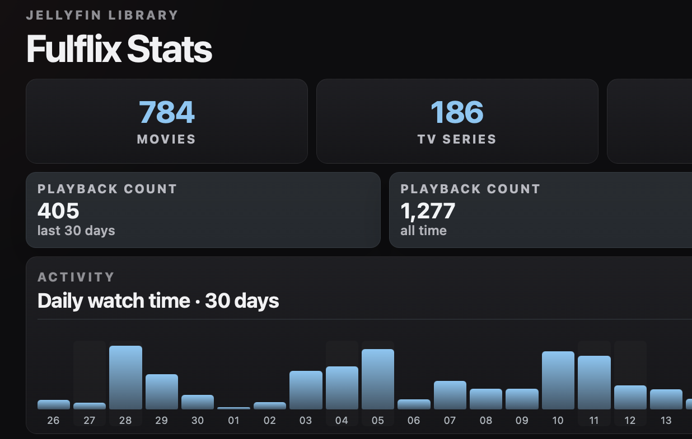
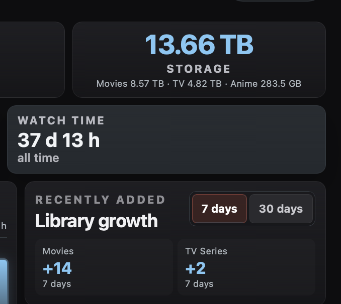
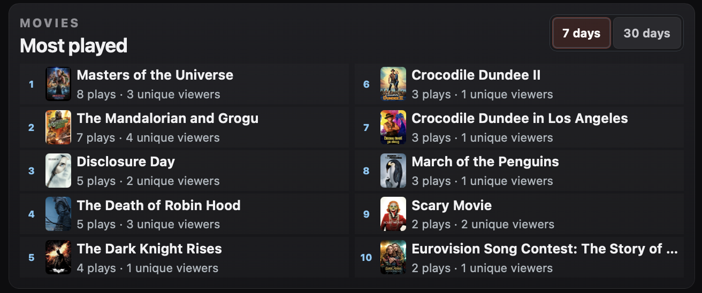
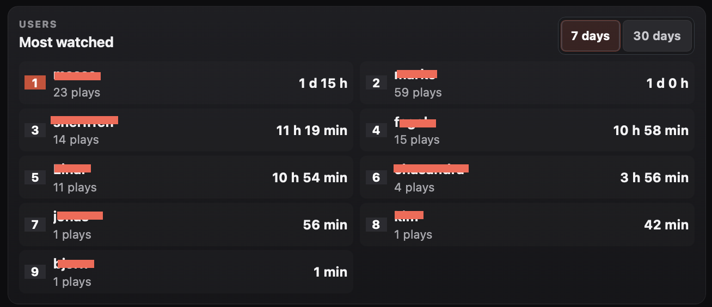
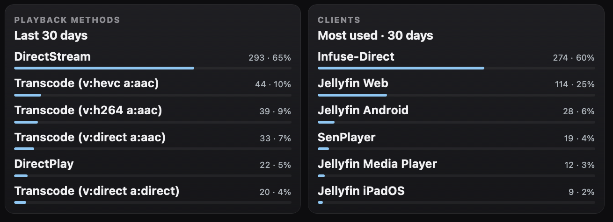
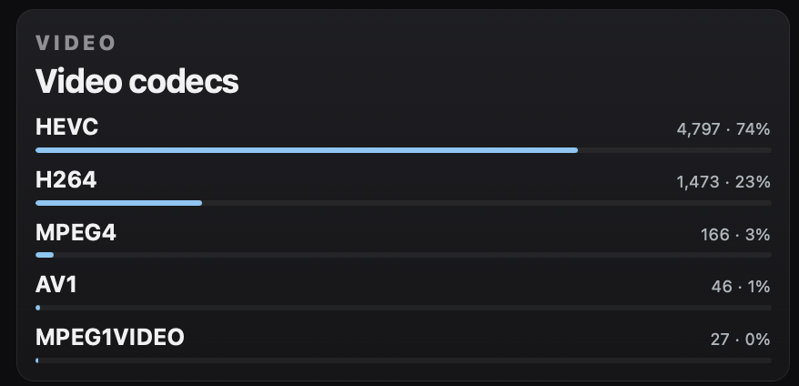

# Jelana

**A modern analytics dashboard for Jellyfin.**

Jelana presents playback history, watch time, active users, library statistics,
media profiles, recently added items, and play-count rankings in a responsive
web dashboard.

## Screenshots

<table>
  <tr>
    <td width="50%"></td>
    <td width="50%"></td>
  </tr>
  <tr>
    <td width="50%"></td>
    <td width="50%"></td>
  </tr>
  <tr>
    <td width="50%"></td>
    <td width="50%"></td>
  </tr>
</table>


## Highlights

- Movie, TV series, episode, and user totals
- Playback count and watch time
- Most-watched movies and TV series for 7 and 30 days
- Most-active users
- Daily watch-time chart
- Playback-method and client statistics
- Recently added media and library growth
- Storage usage by media library
- Video codec, resolution, and audio codec summaries
- Local poster proxy and cache
- Hourly JSON dashboard cache with locking and atomic writes
- Responsive interface with configurable sections
- Central configuration for branding, paths, database, cache, and timezone


## Requirements

- PHP 8.1 or later
- Apache, Nginx with PHP-FPM, or another PHP-capable web server
- PHP extensions:
  - `curl`
  - `json`
  - `mbstring`
  - `pdo_sqlite`
- Jellyfin server access
- Jellyfin Playback Reporting plugin
- Read access to the Playback Reporting SQLite database
- Read access to media paths when storage totals are enabled

## Project Structure

```text
.
├── .github/
│   ├── ISSUE_TEMPLATE/
│   └── PULL_REQUEST_TEMPLATE.md
├── bin/
│   └── refresh-dashboard.php
├── css/
│   └── style.css
├── inc/
│   ├── app.php
│   ├── dashboard.php
│   └── jellyfin.php
├── CHANGELOG.md
├── CONFIGURATION.md
├── CONTRIBUTING.md
├── HOURLY-CACHE-INSTALL.md
├── LICENSE
├── README.md
├── SECURITY.md
├── config.example.php
├── jelana.cron.example
├── image.php
└── index.php
```

`config.php` is excluded from version control because it contains local paths,
server details, and an API key.

## Installation

A condensed step-by-step guide is available in [INSTALL.md](INSTALL.md).

Clone or copy the project into the web root:

```bash
cd /var/www/html
git clone <repository-url> jelana
cd jelana
```

Create the local configuration:

```bash
cp config.example.php config.php
```

Edit **only `config.php`** for installation-specific values:

```php
<?php

declare(strict_types=1);

$appName = 'My Jellyfin';

$jellyfinServer = 'https://jellyfin.example.com:8920';
$apiKey = 'YOUR_API_KEY';

$brandHomeUrl = $jellyfinServer;
$brandLogoUrl = ''; // Optional logo URL

$playbackDatabase = '/var/lib/jellyfin/data/playback_reporting.db';

$mediaLibraries = [
    'Movies' => '/mnt/media/movies',
    'TV Series' => '/mnt/media/tv',
    // 'Anime' => '/mnt/media/anime',
];

$cacheDirectory = '/var/cache/jelana';
$timezone = 'Europe/Stockholm';
```

The array keys in `$mediaLibraries` become the storage labels on the dashboard.
Any number of media directories can be configured without editing application
source code.

The web server and refresh job require:

- Read access to `config.php`
- Read access to the Playback Reporting database
- Read access to the configured media directories
- Write access to the configured cache directory

## Create the Cache Directory

Create a shared cache directory before running the web application or cron job:

```bash
sudo install -d -o www-data -g www-data -m 0770 /var/cache/jelana
sudo install -d -o www-data -g www-data -m 0770 /var/cache/jelana/posters
```

A fixed path is used instead of the system temporary directory so Apache,
PHP-FPM, and cron all access the same cache even when systemd `PrivateTmp` is
enabled.

## Build the Initial Cache

```bash
sudo -u www-data php bin/refresh-dashboard.php
```

A successful refresh prints a timestamp and elapsed time.

The dashboard cache is stored by default at:

```text
/var/cache/jelana/dashboard.json
```

Poster files are stored separately at:

```text
/var/cache/jelana/posters/
```

## Hourly Refresh

Install the included cron definition:

```bash
sudo cp jelana.cron.example /etc/cron.d/jelana
sudo chmod 644 /etc/cron.d/jelana
sudo touch /var/log/jelana.log
sudo chown www-data:www-data /var/log/jelana.log
```

The default schedule runs at the top of every hour:

```cron
0 * * * * www-data /usr/bin/php /var/www/html/bin/refresh-dashboard.php >> /var/log/jelana.log 2>&1
```

See [HOURLY-CACHE-INSTALL.md](HOURLY-CACHE-INSTALL.md) for verification and
troubleshooting steps.

## Cache Architecture

```text
Browser
  │
  └── index.php
        │
        └── dashboard.json

Scheduled refresh
  │
  └── bin/refresh-dashboard.php
        ├── Jellyfin API
        ├── Playback Reporting SQLite database
        └── dashboard.json
```

The refresh process:

1. Obtains an exclusive lock.
2. Collects Jellyfin and Playback Reporting data.
3. Writes a temporary JSON file.
4. Atomically renames the file into place.
5. Releases the lock.

If the cache does not exist, the first page request builds it once.

## Security

- Never commit `config.php`.
- Use a dedicated Jellyfin API key and rotate it if exposed.
- Restrict filesystem permissions to the required database and media paths.
- Place the dashboard behind authentication or a trusted reverse proxy when it
  is accessible outside a trusted network.
- Review [SECURITY.md](SECURITY.md) before reporting a vulnerability.

## Validation

Check every PHP file:

```bash
find . -name '*.php' -print0 | xargs -0 -n1 php -l
```

Refresh the cache after backend changes:

```bash
sudo -u www-data php bin/refresh-dashboard.php
```

## Terminology

The interface uses the following terms consistently:

- **Playback count** for the number of distinct playback sessions
- **Watch time** for accumulated playback duration
- **TV Series** for series-level media
- **Recently Added** for newly indexed library items
- **Playback Methods** for direct play, direct stream, and transcoding
- **Media Profile** for codec and resolution summaries
- **Cached data** for the prepared dashboard JSON

## Known Limitations

- Playback accuracy depends on the data recorded by the Playback Reporting
  plugin.
- Series rankings depend on Jellyfin metadata resolving episodes to their
  parent series.
- Storage totals require filesystem access to the configured media paths.
- The dashboard currently uses one configured Jellyfin server.
- The interface does not provide authentication by itself.

## Roadmap

Potential future work:

- Configurable timezone and locale
- Optional application-level authentication
- Additional date ranges
- Exportable reports
- Automated tests
- Screenshot documentation

## Contributing

See [CONTRIBUTING.md](CONTRIBUTING.md).

## Changelog

See [CHANGELOG.md](CHANGELOG.md).

## Releases

Stable versions are published through GitHub Releases and follow semantic
versioning. For support requests and bug reports, include the version shown in
the dashboard footer.

The first public Jelana release is **v2.1.0**.

## Suggested GitHub topics

`jellyfin` · `analytics` · `dashboard` · `php` · `sqlite` · `media-server` · `statistics`

## License

Jelana is available under the [MIT License](LICENSE).
